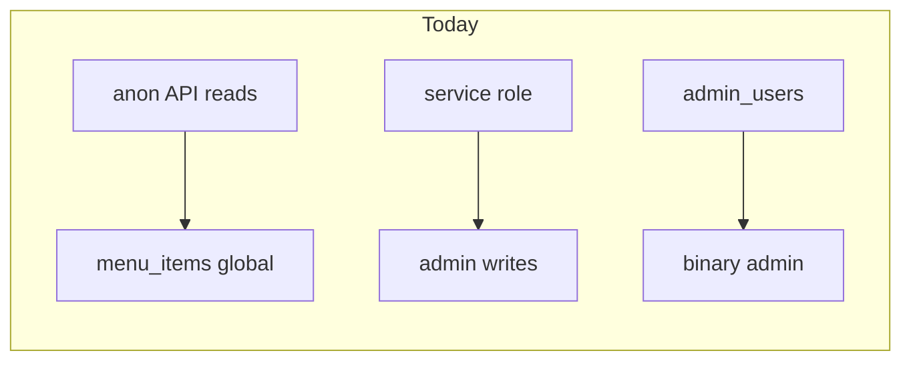
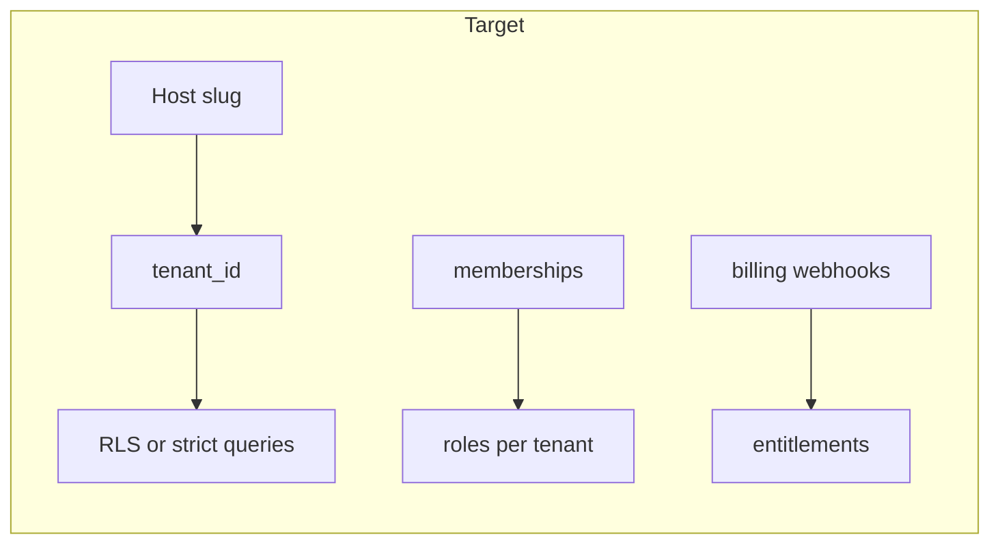

# SaaS conversion plan (subdomain tenants)

## Current state (baseline)

- **Data model is single-tenant:** [`menu_categories`](supabase/migrations/20260428_create_menu_tables.sql) / [`menu_items`](supabase/migrations/20260428_create_menu_tables.sql) have no tenant key; [`restaurant_settings`](supabase/migrations/20260430_create_restaurant_settings.sql) is read publicly with `using (true)` and the app picks the **latest** row by `updated_at` (see pattern referenced in admin settings).
- **Admin gate:** [`lib/admin/is-admin.ts`](lib/admin/is-admin.ts) checks [`admin_users`](supabase/migrations/20260429_create_admin_users.sql) only — no organization scope.
- **APIs:** Public menu reads hit [`app/api/menu/route.ts`](app/api/menu/route.ts) with no tenant filter; writes use **service role** after [`requireAdminUser`](lib/admin/api.ts) in API routes.
- **Auth:** Supabase only ([`lib/supabase/server.ts`](lib/supabase/server.ts), [`proxy.ts`](proxy.ts) + [`lib/supabase/middleware.ts`](lib/supabase/middleware.ts)); **no** subscription/payment code ([`package.json`](package.json)).

## Target shape (subdomain SaaS)

- **Tenant:** e.g. `restaurants` (or `organizations`) with `id`, **`slug`** (unique), display name, billing fields, status.
- **Membership:** users belong to tenants with roles (`owner`, `staff`, …) — replaces or extends flat `admin_users`.
- **Host resolution:** middleware reads `Host`, maps `{slug}.BASE_DOMAIN` → `tenant_id`, attaches to request (header, cookie, or async-local context) for server components and route handlers.
- **Scoped queries:** every read/write for menu/settings/images includes `tenant_id` (or joins through it).
- **Billing:** provider (Stripe assumed below) + webhooks updating subscription status; **gate** admin dashboard and destructive actions when past due/canceled (policy you define).
- **Storage:** bucket paths and Storage RLS (or signed URLs) **namespaced** by `tenant_id` / slug.

## Architecture decisions (locked / recommended)

| Topic       | Choice                                                                                                                    |
| ----------- | ------------------------------------------------------------------------------------------------------------------------- |
| Public URLs | `{slug}.BASE_DOMAIN` for customer menu; apex domain for marketing + auth                                                  |
| Admin URLs  | `app.BASE_DOMAIN` (or `dashboard.`) for logged-in management; pick tenant from session or path segment after login        |
| Isolation   | Prefer **Postgres RLS** keyed by `tenant_id` + membership; reduce blind service-role usage for tenant data                |
| Billing     | **Stripe** Billing or Checkout + Customer Portal + webhooks (industry default; adjust if you prefer Paddle/Lemon Squeezy) |

---

## Task list (implementation order)

### Phase 1 — Tenant model and migrations

1. **Design tables:** `restaurants` (tenant): `id`, `slug` (unique), `name`, `created_at`, optional `stripe_customer_id`, `subscription_status`, `plan`, trial dates.
2. **Membership:** `restaurant_members` (`restaurant_id`, `user_id`, `role`, timestamps, unique `(restaurant_id, user_id)`). Migrate existing [`admin_users`](supabase/migrations/20260429_create_admin_users.sql) rows into memberships for a **bootstrap** tenant or manual SQL backfill.
3. **Add `restaurant_id` (uuid, FK, indexed)** to `menu_categories`, `menu_items`, and `restaurant_settings` (one row per restaurant or merge settings columns into `restaurants` — avoid “latest row wins”).
4. **Backfill + constraints:** single-tenant data gets one seeded `restaurants` row; enforce `NOT NULL` on `restaurant_id` after backfill.
5. **Deprecate** standalone `admin_users` once parity tests pass (or keep as view for transition).

### Phase 2 — RLS and security hardening

1. **RLS policies:** replace broad reads with policies like “menu readable if category/item belongs to restaurant X” using membership or a **`tenant_id` claim** (Supabase custom JWT claims optional).
2. **Service role:** restrict to **system** jobs (webhooks, migrations); tenant admin routes use **user session + RLS** or explicit `restaurant_id` checks in server code.
3. **API routes:** [`app/api/menu/route.ts`](app/api/menu/route.ts) and [`app/api/menu/[slug]/route.ts`](app/api/menu/[slug]/route.ts) must resolve tenant from **host** (subdomain), not from client-supplied id alone (prevent cross-tenant leaks).
4. **Admin APIs:** [`app/api/admin/categories/route.ts`](app/api/admin/categories/route.ts), [`app/api/admin/menu/route.ts`](app/api/admin/menu/route.ts) — require authenticated user + membership for **that** restaurant + subscription OK.

### Phase 3 — Subdomain routing and Next.js integration

1. **Env:** `NEXT_PUBLIC_ROOT_DOMAIN` (apex), `NEXT_PUBLIC_APP_DOMAIN` (optional `app.` host), document **wildcard DNS** (`*.yourdomain.com`) for production.
2. **Middleware:** extend [`proxy.ts`](proxy.ts) / [`lib/supabase/middleware.ts`](lib/supabase/middleware.ts) pattern (or add root `middleware.ts` if you consolidate): parse `Host`, resolve slug → tenant (cache-friendly lookup), set **tenant context** for downstream handlers; redirect apex menu URLs if needed.
3. **Segment routes:** move or duplicate customer routes under a tenant-aware layout (e.g. `(tenant)/menu`) **or** keep `/menu` but branch on resolved tenant from host — ensure **links** on subdomain stay relative to current host.
4. **Admin app shell:** after login, user picks restaurant (if multiple) or lands on default; URLs like `app.BASE_DOMAIN/r/{slug}/admin/...` **or** session-sticky tenant without exposing slug in path — pick one pattern and apply consistently in [`app/admin/`](app/admin/).

### Phase 4 — Storage and assets

1. **Supabase Storage:** namespace uploads (`restaurant_id/slug/...`); add **storage policies** aligned with RLS; update [`app/admin/menu/_lib/menu-image-storage.ts`](app/admin/menu/_lib/menu-image-storage.ts) (and callers) to use tenant-scoped paths.
2. **QR / public URLs:** [`app/admin/qr/page.tsx`](app/admin/qr/page.tsx) uses `NEXT_PUBLIC_SITE_URL` — generate **per-tenant** public menu URLs using subdomain + HTTPS.

### Phase 5 — Billing and entitlements

1. **Stripe:** products/prices (monthly/yearly), Checkout Session for signup/upgrade, Customer Portal link on billing settings page.
2. **Webhooks:** `/api/webhooks/stripe` — sync `subscription_status`, trial end, cancel at period end; **idempotent** handler storing events if needed.
3. **Enforcement:** middleware or server guards block **admin** access when subscription invalid; decide whether **public menu** stays readable (read-only grace) or shows banner — product decision.

### Phase 6 — Onboarding and ops

1. **Signup flow:** register → create `restaurants` row with chosen slug (availability check) → Stripe Checkout (optional trial) → redirect to admin wizard.
2. **Slug collision / abuse:** rate limits on signup, reserved slugs (`www`, `app`, `api`, `admin`).
3. **Observability:** structured logs for tenant resolution failures; alerts on webhook errors.

### Phase 7 — Cleanup and launch

1. **Remove or update** misleading SaaS copy on [`app/page.tsx`](app/page.tsx) to match real billing.
2. **E2E tests:** critical paths — subdomain menu load, admin edit scoped to tenant, webhook status transitions.
3. **Runbooks:** DNS (apex + wildcard), env vars per env (staging subdomain), Stripe test vs live keys.

---

## Risk notes

- **JWT size / lookup:** heavy use of host→tenant lookup per request — use edge caching or DB index on `slug` and short TTL cache in middleware if needed.
- **Local dev:** map `slug.localhost` via `/etc/hosts` or a dev proxy (e.g. `lvh.me`, `nip.io`) so subdomain logic matches production.
- **Breaking change:** existing bookmarks to `/menu` on apex must redirect or show tenant picker.
