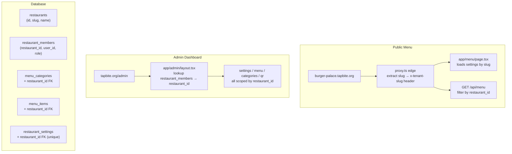

# SaaS Subdomain Conversion Plan

## Scope

- No Stripe/billing in this phase
- No signup flow — restaurants added manually via seed/SQL
- Client design: unchanged (API consumption only)
- Admin design: unchanged (queries scoped, membership model adopted)

## Architecture After



---

## Phase 1 — Fresh Migrations

**Problem:** existing migration files fail from the Supabase CLI (ordering/syntax issues; manually named files don't match the CLI's expected `YYYYMMDDHHmmss_name.sql` timestamp format).

**Fix:** delete all files in [`supabase/migrations/`](supabase/migrations/), then generate a properly timestamped file via the CLI:

```bash
supabase migration new saas_schema
```

This produces `supabase/migrations/<timestamp>_saas_schema.sql`. Populate that generated file with the full schema SQL below. After writing, apply with:

```bash
supabase db reset   # local
# or
supabase db push    # linked remote
```

New tables added:

- `restaurants` — `(id, slug unique, name, status, created_at, updated_at)`
- `restaurant_members` — `(id, restaurant_id → restaurants, user_id → auth.users, role, created_at, unique(restaurant_id, user_id))` — replaces `admin_users`

Existing tables updated:

- `menu_categories` — add `restaurant_id` FK; change `unique(slug)` → `unique(restaurant_id, slug)`
- `menu_items` — add `restaurant_id` FK; same slug uniqueness change
- `restaurant_settings` — add `restaurant_id` FK with `unique` (one row per restaurant)
- Storage bucket `menu-images` (keep, created via INSERT)

RLS policies:

- Public `SELECT` on categories/items: `using (true)` — tenant isolation enforced in application-level `WHERE restaurant_id = ?` (safe for read-only public data)
- `restaurant_members`: `using (user_id = auth.uid())` — only readable by own user
- Admin writes: `authenticated` + membership check enforced in server code (service role for writes)

---

## Phase 2 — Updated Seed Data

[`supabase/seed.sql`](supabase/seed.sql) updated to:

1. Insert demo restaurant: `slug='demo', name='Tab Bite Demo'`
2. Insert `restaurant_settings` row linked to demo restaurant
3. All category inserts gain `restaurant_id`; conflict key changes to `(restaurant_id, slug)`
4. All item inserts gain `restaurant_id`; conflict key changes to `(restaurant_id, slug)`

---

## Phase 3 — Subdomain Tenant Resolution

[`proxy.ts`](proxy.ts) — broadened matcher + slug extraction passed into `updateSession`:

```typescript
const host = request.headers.get("host") || "";
const rootDomain = process.env.NEXT_PUBLIC_ROOT_DOMAIN ?? "tapbite.org";
const tenantSlug = host.endsWith(`.${rootDomain}`)
  ? host.slice(0, -(rootDomain.length + 1))
  : null;
// forwarded to updateSession(request, tenantSlug)
```

Matcher broadened to cover all non-static paths.

[`lib/supabase/middleware.ts`](lib/supabase/middleware.ts) — `updateSession` accepts `tenantSlug`, injects `x-tenant-slug` into the forwarded `NextResponse` request headers.

[`.env`](.env) — add `NEXT_PUBLIC_ROOT_DOMAIN=tapbite.org`

---

## Phase 4 — API Route Updates (public menu)

[`app/api/menu/route.ts`](app/api/menu/route.ts) and [`app/api/menu/[slug]/route.ts`](app/api/menu/[slug]/route.ts):

- Read `x-tenant-slug` from `request.headers`
- Resolve `restaurant_id` via `SELECT id FROM restaurants WHERE slug = $slug`
- Add `.eq('restaurant_id', restaurantId)` to all queries
- Return 404 if slug not found

No changes to `components/client/menu-provider.tsx` — it calls `/api/menu` from the browser; the same `Host` header flows through the proxy automatically.

---

## Phase 5 — Admin Query Scoping

[`lib/admin/is-admin.ts`](lib/admin/is-admin.ts) → replaced by `lib/admin/get-restaurant.ts`:

```typescript
export async function getAdminRestaurant(supabase) {
  const { data: { user } } = await supabase.auth.getUser();
  if (!user) return null;
  const { data } = await supabase
    .from("restaurant_members")
    .select("restaurant_id, role, restaurants(id, slug, name)")
    .eq("user_id", user.id)
    .limit(1)
    .single();
  return data ?? null;
}
```

[`lib/admin/api.ts`](lib/admin/api.ts) — `requireAdminUser` updated to check `restaurant_members` instead of `admin_users`; returns `restaurant_id`.

[`app/admin/layout.tsx`](app/admin/layout.tsx) — replace `admin_users` lookup with `restaurant_members`; load `restaurant_settings` by `restaurant_id` (no layout design change).

[`app/admin/settings/page.tsx`](app/admin/settings/page.tsx) — `saveSettings` upserts on `restaurant_id` conflict key (not arbitrary latest row).

[`app/admin/menu/page.tsx`](app/admin/menu/page.tsx) and [`app/admin/categories/page.tsx`](app/admin/categories/page.tsx) — all service-role queries gain `.eq('restaurant_id', restaurantId)`.

[`app/api/admin/menu/route.ts`](app/api/admin/menu/route.ts) and [`app/api/admin/categories/route.ts`](app/api/admin/categories/route.ts) — resolve `restaurant_id` from membership, scope all mutations.

---

## Phase 6 — Storage + QR URL

[`app/admin/menu/_lib/menu-image-storage.ts`](app/admin/menu/_lib/menu-image-storage.ts) — prefix upload paths with `{restaurant_id}/` for tenant isolation.

[`app/admin/qr/page.tsx`](app/admin/qr/page.tsx) — pass restaurant slug from membership; QR generator builds `https://{slug}.tapbite.org/menu`.

[`app/admin/qr/_components/qr-table-generator.tsx`](app/admin/qr/_components/qr-table-generator.tsx) — accept `restaurantSlug` prop, compute base URL from it (replaces `NEXT_PUBLIC_SITE_URL`).

---

## Phase 7 — Public Menu Page

[`app/menu/page.tsx`](app/menu/page.tsx) — read `x-tenant-slug` from `headers()`, resolve to `restaurant_id`, filter `restaurant_settings` by `restaurant_id` (replaces "latest row" pattern).

---

## Files Changed Summary

- DELETE: all 5 existing files in `supabase/migrations/`
- NEW (CLI-generated): `supabase/migrations/<timestamp>_saas_schema.sql`
- UPDATE: `supabase/seed.sql`
- UPDATE: `proxy.ts`
- UPDATE: `lib/supabase/middleware.ts`
- RENAME/REPLACE: `lib/admin/is-admin.ts` → `lib/admin/get-restaurant.ts`
- UPDATE: `lib/admin/api.ts`
- UPDATE: `app/admin/layout.tsx`
- UPDATE: `app/admin/settings/page.tsx`
- UPDATE: `app/admin/menu/page.tsx`
- UPDATE: `app/admin/categories/page.tsx`
- UPDATE: `app/admin/menu/_lib/menu-image-storage.ts`
- UPDATE: `app/admin/qr/page.tsx` + `_components/qr-table-generator.tsx`
- UPDATE: `app/menu/page.tsx`
- UPDATE: `app/api/menu/route.ts` + `[slug]/route.ts`
- UPDATE: `app/api/admin/menu/route.ts` + `categories/route.ts`
- UPDATE: `.env` (add `NEXT_PUBLIC_ROOT_DOMAIN`)

No changes to: client components, basket, wishlist, login, cart, language toggle, any UI design files.
