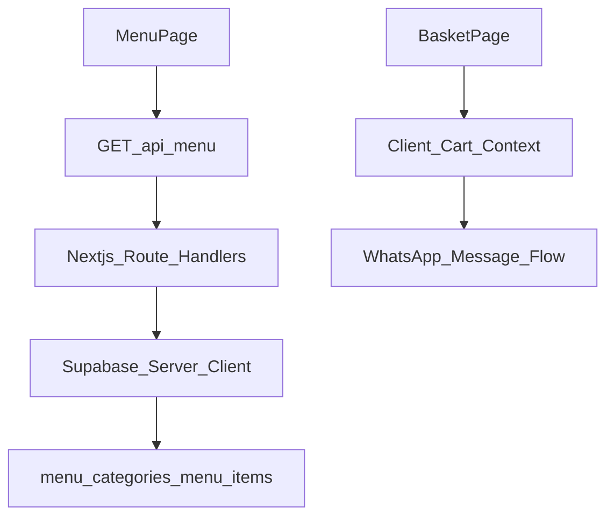

# Supabase Backend Plan: Menu API Only (MVP)

## Scope

- Build backend for:
  - Supabase connection and shared server client setup.
  - Public **menu read APIs**.
- Keep basket, totals, and WhatsApp order flow on frontend.
- No admin authentication in this phase.

## Current Frontend Alignment

- Menu currently uses local static data in `[/home/alamin/Desktop/web-dev/qr-menu/lib/menu.ts](/home/alamin/Desktop/web-dev/qr-menu/lib/menu.ts)`.
- Basket is currently in client context in `[/home/alamin/Desktop/web-dev/qr-menu/components/client/cart-provider.tsx](/home/alamin/Desktop/web-dev/qr-menu/components/client/cart-provider.tsx)`.
- Basket and checkout screen behavior is in `[/home/alamin/Desktop/web-dev/qr-menu/app/basket/_components/basket-screen.tsx](/home/alamin/Desktop/web-dev/qr-menu/app/basket/_components/basket-screen.tsx)`.

## Proposed DB Structure (Supabase Postgres)

### 1) `menu_categories`

- `id` (uuid, pk)
- `slug` (text, unique)
- `name_en`, `name_bn` (text)
- `sort_order` (int)
- `is_active` (bool default true)
- `created_at`, `updated_at` (timestamptz)

### 2) `menu_items`

- `id` (uuid, pk)
- `slug` (text, unique)
- `category_id` (uuid, fk -> `menu_categories.id`)
- `name_en`, `name_bn` (text)
- `description_en`, `description_bn` (text)
- `price` (numeric(10,2))
- `image_url` (text)
- `available` (bool default true)
- `is_active` (bool default true)
- `created_at`, `updated_at` (timestamptz)

### Optional for near-future checkout: `baskets`, `basket_items`, `orders`, `order_items`

- Defer these tables to a later phase when moving beyond frontend-only WhatsApp checkout.

## RLS + Access Policy (Phase 1)

- `menu_categories`, `menu_items`: public `select` for active items only.
- Service role key stays server-only in Next.js route handlers.

## API Structure (Next.js App Router)

### Suggested route files

- `[/home/alamin/Desktop/web-dev/qr-menu/app/api/menu/route.ts](/home/alamin/Desktop/web-dev/qr-menu/app/api/menu/route.ts)`
- `[/home/alamin/Desktop/web-dev/qr-menu/app/api/menu/[slug]/route.ts](/home/alamin/Desktop/web-dev/qr-menu/app/api/menu/[slug]/route.ts)`

### Endpoint contracts

- `GET /api/menu`
  - Query: `category`, `available`, `q`
  - Returns grouped or flat menu item list.
- `GET /api/menu/:slug`
  - Returns one menu item detail.

## Shared Backend Utilities

- Add Supabase server helpers in:
  - `[/home/alamin/Desktop/web-dev/qr-menu/lib/supabase/server.ts](/home/alamin/Desktop/web-dev/qr-menu/lib/supabase/server.ts)`
  - `[/home/alamin/Desktop/web-dev/qr-menu/lib/supabase/env.ts](/home/alamin/Desktop/web-dev/qr-menu/lib/supabase/env.ts)`
- Add API DTO/validation schema in:
  - `[/home/alamin/Desktop/web-dev/qr-menu/lib/api/schemas.ts](/home/alamin/Desktop/web-dev/qr-menu/lib/api/schemas.ts)`
  - `[/home/alamin/Desktop/web-dev/qr-menu/lib/api/responses.ts](/home/alamin/Desktop/web-dev/qr-menu/lib/api/responses.ts)`

## Data Flow (Phase 1)

## Implementation Order

1. Configure Supabase env vars and server client.
2. Create SQL migrations for `menu_categories`, `menu_items`.
3. Seed initial menu from existing static data.
4. Implement menu read APIs.
5. Wire frontend menu data fetches from APIs.
6. Keep cart totals and WhatsApp message generation in frontend.
7. Add basic API tests (happy path + invalid payload + missing item).

## Risks and Guardrails

- Frontend total tampering risk remains for WhatsApp-only MVP; acceptable for this phase.
- Cart state is device-local only in this phase (no cross-device recovery).
- Direct key exposure: never expose service role key to client bundles.
